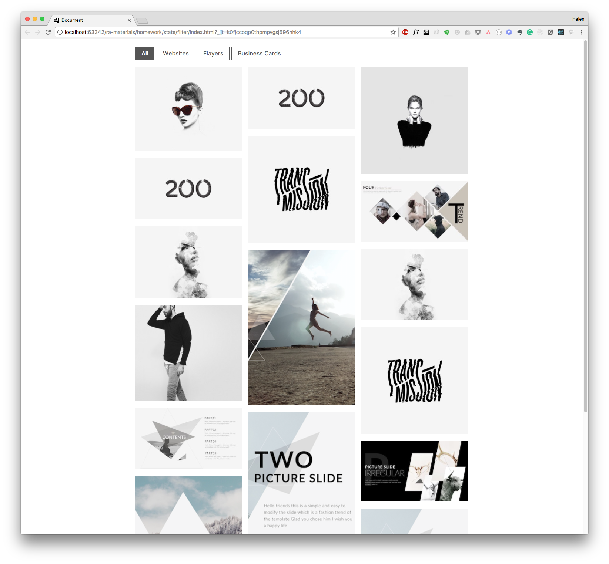

## **`!РЕШЕНО! Состояние компонентов.` ~~Все задачи~~**  
### Задачи разделены по компонентам в папке components

---

### Ссылкка на [github-pages](https://rt-vinsent.github.io/ra16-hw-2/)

---

[](https://ci.appveyor.com/project/RT-Vinsent/ra16-hw-2)

[](https://github.com/RT-Vinsent/ra16-hw-1/actions/workflows/pages/pages-build-deployment)

---

Состояние компонентов
===

Необходимо выполнить и предоставить на проверку следующие задачи:

<details>
<summary>1. Портфолио с фильтрами</summary>

## Портфолио с фильтрами

Необходимо реализовать портфолио с фильтрами, аналогичное указанному на изображении.



## Описание проекта

Разработайте компонент класса `Portfolio`, хранящий список фильтров, активный фильтр, а также список проектов.

Сами фильтры отображаются в компоненте без состояния `Toolbar`, которому от `Portfolio` мы передаём три свойства:
- `filters` — список фильтров, название которых совпадает с категориями проектов;
- `selected` — активный фильтр;
- `onSelectFilter(filter)` — обработчик события, который реагирует на выбор пользователем одного из фильтров, обработчик принимает один аргумент — строку с названием фильтра.

Пример:
```
<Toolbar
  filters={["All", "Websites", "Flayers", "Business Cards"]}
  selected="All"
  onSelectFilter={(filter) => {console.log(filter);}}/>
```

В этом примере при выборе фильтра его название будет выведено в консоль. Например, «Business Cards».

Изображения самих проектов отображаются компонентом без состояния `ProjectList`, которому от `Portfolio` мы передаём список проектов — в свойство `projects`. Отображение проектов — это единственная ответственность компонента `ProjectList`.

Чтобы компонент `Portfolio` мог реагировать на выбор пользователем фильтра проектов, например, `Business Cards`, и передавать отфильтрованные по категории `Business Cards` проекты в компонент `ProjectList`, в класс `Portfolio` необходимо добавить состояние (state).

Ваша задача:
- установить состояние выбранного фильтра в обработчике события, который `Portfolio` передаёт в свойство `onSelectFilter` компонента `Toolbar`;
- из компонента `Portfolio` передать активный фильтр в свойство `selected` компонента `Toolbar`;
- в компоненте `Portfolio` отфильтровать по активному фильтру проекты и передать их в компонент `ProjectList`.


Набор данных для отображения:
```js
[{
  img: "https://raw.githubusercontent.com/netology-code/ra16-homeworks/master/events-state/filter/img/mon.jpg",
  category: "Business Cards"
}, {
  img: "https://raw.githubusercontent.com/netology-code/ra16-homeworks/master/events-state/filter/img/200.jpg",
  category: "Websites"
}, {
  img: "https://raw.githubusercontent.com/netology-code/ra16-homeworks/master/events-state/filter/img/emi_haze.jpg",
  category: "Websites"
}, {
  img: "https://raw.githubusercontent.com/netology-code/ra16-homeworks/master/events-state/filter/img/codystretch.jpg",
  category: "Websites"
}, {
  img: "https://raw.githubusercontent.com/netology-code/ra16-homeworks/master/events-state/filter/img/Triangle_003.jpg",
  category: "Business Cards"
}, {
  img: "https://raw.githubusercontent.com/netology-code/ra16-homeworks/master/events-state/filter/img/place200x290.png",
  category: "Websites"
}, {
  img: "https://raw.githubusercontent.com/netology-code/ra16-homeworks/master/events-state/filter/img/200.jpg",
  category: "Websites"
}, {
  img: "https://raw.githubusercontent.com/netology-code/ra16-homeworks/master/events-state/filter/img/transmission.jpg",
  category: "Business Cards"
}, {
  img: "https://raw.githubusercontent.com/netology-code/ra16-homeworks/master/events-state/filter/img/place200x290_1.png",
  category: "Websites"
}, {
  img: "https://raw.githubusercontent.com/netology-code/ra16-homeworks/master/events-state/filter/img/place200x290_2.png",
  category: "Flayers"
}, {
  img: "https://raw.githubusercontent.com/netology-code/ra16-homeworks/master/events-state/filter/img/the_ninetys_brand.jpg",
  category: "Websites"
}, {
  img: "https://raw.githubusercontent.com/netology-code/ra16-homeworks/master/events-state/filter/img/dia.jpg",
  category: "Business Cards"
}, {
  img: "https://raw.githubusercontent.com/netology-code/ra16-homeworks/master/events-state/filter/img/Triangle_350x197.jpg",
  category: "Websites"
}, {
  img: "https://raw.githubusercontent.com/netology-code/ra16-homeworks/master/events-state/filter/img/emi_haze.jpg",
  category: "Websites"
}, {
  img: "https://raw.githubusercontent.com/netology-code/ra16-homeworks/master/events-state/filter/img/transmission.jpg",
  category: "Business Cards"
}, {
  img: "https://raw.githubusercontent.com/netology-code/ra16-homeworks/master/events-state/filter/img/Triangle_350x197_1.jpg",
  category: "Websites"
}, {
  img: "https://raw.githubusercontent.com/netology-code/ra16-homeworks/master/events-state/filter/img/place200x290_3.png",
  category: "Flayers"
}]
```

</details>

<details>
<summary>2. Расположение товаров</summary>

</details>

<details>
<summary>3. Выпадающий список  — необязательная задача</summary>

</details>

Все три задачи лучше сдавать в разных репозиториях, то есть через create-react-app реализовать три проекта, чтобы не
было конфликта стилей. Но если вы позаботитесь о том, что конфликта не будет, то можете сдавать и в одном проекте.

Все стили необходимо размещать в файле App.css.

#### Альтернативный способ создания приложения React с использованием тулинга Vite

Приложение также можно создать используя инструмент Vite.
Документация по созданию приложения [React](https://vitejs.dev/guide/).

1. Откройте терминал и пропишите следующую команду: `yarn create vite my-app --template react`,
   либо `yarn create vite my-app --template react-ts`, если
   нужен шаблон с TypeScript. Эта команда создаст настроенный
   шаблонный проект.
2. Откройте созданный проект в своей IDE.
3. Установите зависимости.
4. Готово. Чтобы запустить приложение, введите команду: `yarn dev`(либо `npm run dev`).
 